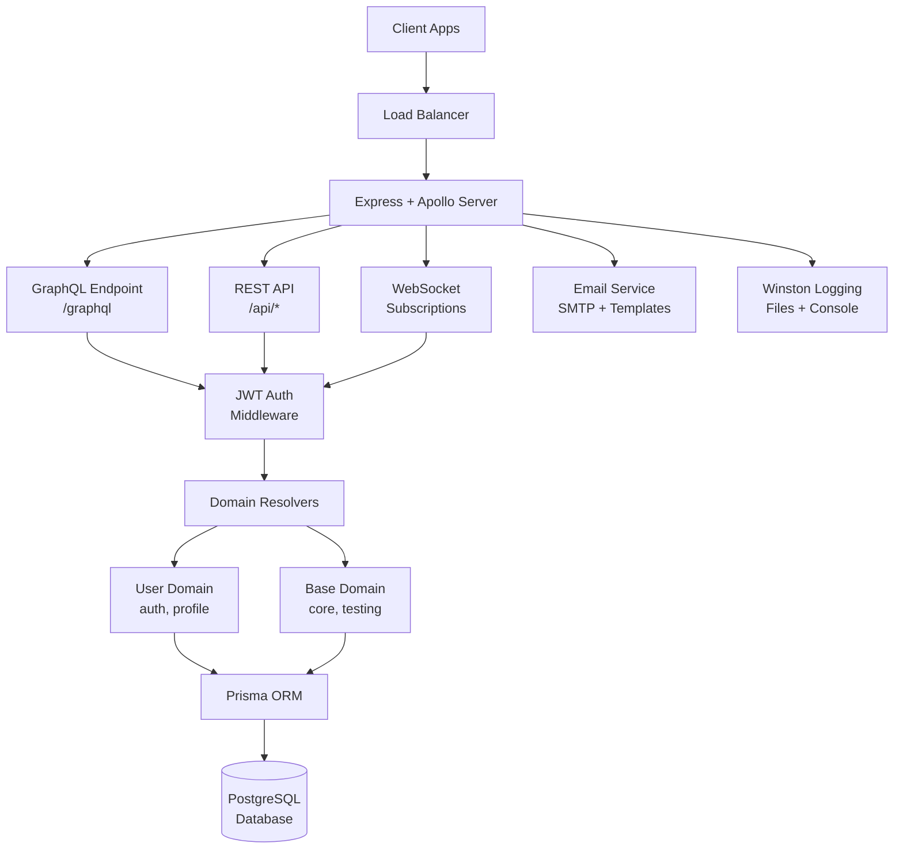

# Express Apollo Server 🚀

<div align="center">

**Production-Ready Node.js Backend with REST + GraphQL + Real-time Subscriptions**

[](https://nodejs.org/)
[](https://www.apollographql.com/docs/apollo-server/)
[](https://www.prisma.io/)
[](https://graphql.org/)
[](https://expressjs.com/)

[📚 Documentation](https://express-apollo-server.netlify.app/) • [🎯 GraphQL Playground](http://localhost:4000/graphql) • [📊 API Analytics](http://localhost:4000/api/analytics)

</div>

## ✨ Features

🔥 **Modern GraphQL Server**
- Apollo Server v5 with native subscriptions
- Real-time WebSocket communication
- Automatic schema validation and introspection

🛡️ **Robust Authentication**
- JWT with automatic refresh tokens (15min/7day cycle)
- WebSocket authentication for subscriptions  
- Role-based access control (USER/ADMIN/MODERATOR)

⚡ **High-Performance REST API**
- Express.js with comprehensive middleware
- Rate limiting and CORS protection
- Built-in analytics dashboard

🗄️ **Type-Safe Database**
- Prisma ORM with PostgreSQL
- Automatic migrations and schema validation
- Optimized queries with relation loading

🏗️ **Domain-Driven Architecture**
- Organized by business domains (user/, base/)
- Scalable resolver structure
- Clear separation of concerns

📧 **Email System**
- Handlebars templates (welcome, password reset)
- SMTP configuration with fallback
- Automated notification workflows

📊 **Production Features**
- Winston logging with file rotation
- Comprehensive error handling
- Health checks and monitoring
- Jest testing framework

## 🎯 Quick Demo

```bash
# 🚀 One-command setup
git clone https://github.com/Neumao/express-apollo-server.git
cd express-apollo-server && npm install && cp .env.example .env
npx prisma migrate dev && npm run dev

# ✅ Server running at http://localhost:4000
# 🎮 GraphQL Playground: http://localhost:4000/graphql  
# 📊 Analytics Dashboard: http://localhost:4000/api/analytics
```

## 🏗️ Architecture Overview



### 📂 Project Structure

```
src/
├── 🎯 index.js                 # Application entry point
├── ⚙️ config/                  # Configuration & environment
├── 🌐 express/                 # REST API layer
│   ├── 🎮 controllers/         # Route handlers  
│   ├── 🛡️ middleware/          # Auth, logging, errors
│   ├── 🛣️ routes/              # API endpoints
│   └── 🔧 services/            # Business logic
├── 📡 graphql/                 # GraphQL implementation
│   ├── 🏗️ resolvers/           # Domain-based resolvers
│   │   ├── 👤 user/            # User domain (auth, profile)
│   │   └── ⚡ base/            # Core functionality
│   ├── 📋 schema/              # Type definitions
│   └── 🔌 pubsub/              # Real-time subscriptions
├── 📧 email/                   # Email templates & service
├── 🗄️ prisma/                  # Database schema & client
└── 🛠️ utils/                   # Shared utilities
```

## 🚀 Getting Started

### 📋 Prerequisites

- **Node.js 18+** (LTS recommended)
- **PostgreSQL 14+**  
- **npm/yarn**

### ⚡ Installation

```bash
# 1️⃣ Clone repository
git clone https://github.com/Neumao/express-apollo-server.git
cd express-apollo-server

# 2️⃣ Install dependencies  
npm install

# 3️⃣ Environment setup
cp .env.example .env
# Edit .env with your database URL, JWT secrets, etc.

# 4️⃣ Database setup
npx prisma generate
npx prisma migrate dev

# 5️⃣ Start development server
npm run dev
```

Access the endpoints:

- REST API: http://localhost:4000/api
- GraphQL Playground: http://localhost:4000/graphql
- Analytics Dashboard: http://localhost:4000/analytics

## Scripts

- `npm start` - Start the server in production mode
- `npm run dev` - Start the server with auto-reload (nodemon)
- `npm run prisma:migrate` - Run database migrations
- `npm run prisma:studio` - Open Prisma database UI
- `npm test` - Run tests
- `npm run lint` - Check code quality with ESLint

## Project Structure

- `src/express/` — REST controllers, routes, services, middlewares
- `src/graphql/` — schema, resolvers, pubsub
- `src/prisma/` — Prisma schema, migrations, client
- `src/config/` — logger, email, environment config
- `src/utils/` — helpers (JWT, error handling)
- `src/index.js` — entry point, integrates Express and Apollo

## API Endpoints

### REST API

- **Authentication:**

  - POST `/api/auth/register` - Register a new user
  - POST `/api/auth/login` - Login and get JWT token
  - POST `/api/auth/refresh` - Refresh JWT token
  - POST `/api/auth/logout` - Logout and invalidate token

- **User Management:**

  - GET `/api/users` - Get all users (admin only)
  - GET `/api/users/:id` - Get user by ID
  - PUT `/api/users/:id` - Update user
  - DELETE `/api/users/:id` - Delete user

- **Analytics:**
  - GET `/api/analytics` - View API metrics and logs

### GraphQL API

- **Queries:**

  - `users` - Get all users
  - `user(id: ID!)` - Get user by ID

- **Mutations:**

  - `register(input: RegisterInput!)` - Register a new user
  - `login(email: String!, password: String!)` - Login and get JWT token
  - `updateUser(id: ID!, input: UpdateUserInput!)` - Update user
  - `deleteUser(id: ID!)` - Delete user

- **Subscriptions:**
  - `userCreated` - Real-time notification when a new user is created
  - `userUpdated` - Real-time notification when a user is updated

## Testing

Run tests with Jest:

```bash
npm test
```

## License

MIT
