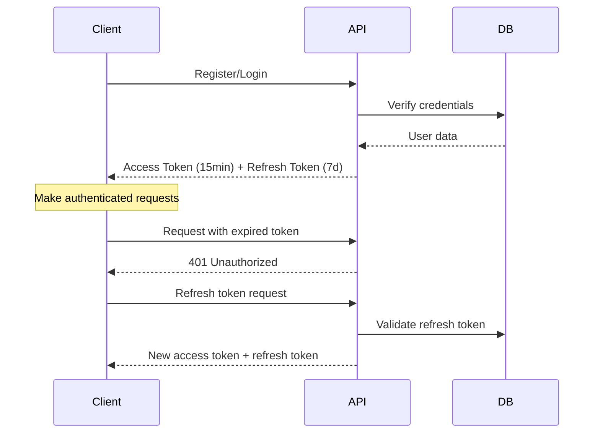

# Authentication Guide

This guide covers the complete JWT authentication system with automatic refresh tokens for both REST and GraphQL APIs.

## Overview

The authentication system provides:
- **JWT Access Tokens** (15-minute expiry)
- **Refresh Tokens** (7-day expiry)
- **Automatic Token Refresh** for both HTTP and WebSocket
- **Role-based Access Control**
- **Session Management**

## Authentication Flow



## Registration

### REST API

```bash
curl -X POST http://localhost:4000/api/auth/register \
  -H "Content-Type: application/json" \
  -d '{
    "name": "John Doe",
    "email": "john@example.com",
    "password": "password123"
  }'
```

### GraphQL

```graphql
mutation RegisterUser {
  register(input: {
    name: "John Doe"
    email: "john@example.com"
    password: "password123"
  }) {
    status
    message
    data {
      id
      name
      email
      authToken        # Access token (15 min)
      refreshToken     # Refresh token (7 days)
    }
  }
}
```

## Login

### REST API

```bash
curl -X POST http://localhost:4000/api/auth/login \
  -H "Content-Type: application/json" \
  -d '{
    "email": "john@example.com",
    "password": "password123"
  }'
```

### GraphQL

```graphql
mutation LoginUser {
  login(input: {
    email: "john@example.com"
    password: "password123"
  }) {
    status
    message
    data {
      id
      name
      email
      authToken
      refreshToken
    }
  }
}
```

## Making Authenticated Requests

### REST API

Include the access token in the Authorization header:

```bash
curl -X GET http://localhost:4000/api/users/profile \
  -H "Authorization: Bearer YOUR_ACCESS_TOKEN"
```

### GraphQL

Set the Authorization header in Apollo Studio or your GraphQL client:

```javascript
// Apollo Client setup
import { ApolloClient, InMemoryCache, createHttpLink } from '@apollo/client';
import { setContext } from '@apollo/client/link/context';

const httpLink = createHttpLink({
  uri: 'http://localhost:4000/graphql',
});

const authLink = setContext((_, { headers }) => {
  const token = localStorage.getItem('accessToken');
  return {
    headers: {
      ...headers,
      authorization: token ? `Bearer ${token}` : "",
    }
  }
});

const client = new ApolloClient({
  link: authLink.concat(httpLink),
  cache: new InMemoryCache()
});
```

## Token Refresh

### Automatic Refresh (Recommended)

The server automatically handles token refresh for GraphQL subscriptions. For HTTP requests, implement client-side refresh:

```javascript
// Axios interceptor example
import axios from 'axios';

const api = axios.create({
  baseURL: 'http://localhost:4000/api'
});

// Request interceptor
api.interceptors.request.use((config) => {
  const token = localStorage.getItem('accessToken');
  if (token) {
    config.headers.Authorization = `Bearer ${token}`;
  }
  return config;
});

// Response interceptor for token refresh
api.interceptors.response.use(
  (response) => response,
  async (error) => {
    const originalRequest = error.config;
    
    if (error.response?.status === 401 && !originalRequest._retry) {
      originalRequest._retry = true;
      
      try {
        const refreshToken = localStorage.getItem('refreshToken');
        const response = await axios.post('/auth/refresh', {
          refreshToken
        });
        
        const { authToken, refreshToken: newRefreshToken } = response.data.data;
        localStorage.setItem('accessToken', authToken);
        localStorage.setItem('refreshToken', newRefreshToken);
        
        originalRequest.headers.Authorization = `Bearer ${authToken}`;
        return api(originalRequest);
      } catch (refreshError) {
        // Redirect to login
        localStorage.removeItem('accessToken');
        localStorage.removeItem('refreshToken');
        window.location.href = '/login';
      }
    }
    
    return Promise.reject(error);
  }
);
```

### Manual Refresh

#### REST API

```bash
curl -X POST http://localhost:4000/api/auth/refresh \
  -H "Content-Type: application/json" \
  -d '{
    "refreshToken": "YOUR_REFRESH_TOKEN"
  }'
```

#### GraphQL

```graphql
mutation RefreshToken {
  refreshToken(refreshToken: "YOUR_REFRESH_TOKEN") {
    status
    message
    data {
      authToken
      refreshToken
    }
  }
}
```

## WebSocket Authentication

For GraphQL subscriptions, pass the token in connection parameters:

```javascript
import { GraphQLWsLink } from '@apollo/client/link/subscriptions';
import { createClient } from 'graphql-ws';

const wsLink = new GraphQLWsLink(createClient({
  url: 'ws://localhost:4000/graphql',
  connectionParams: () => ({
    authorization: `Bearer ${localStorage.getItem('accessToken')}`
  }),
  // Automatic reconnection with fresh token
  connectionParams: async () => {
    let token = localStorage.getItem('accessToken');
    
    // Check if token is expired and refresh if needed
    if (isTokenExpired(token)) {
      try {
        const refreshToken = localStorage.getItem('refreshToken');
        const response = await refreshAccessToken(refreshToken);
        token = response.authToken;
        localStorage.setItem('accessToken', token);
      } catch (error) {
        // Handle refresh failure
        window.location.href = '/login';
        return {};
      }
    }
    
    return {
      authorization: `Bearer ${token}`
    };
  }
}));
```

## Logout

### REST API

```bash
curl -X POST http://localhost:4000/api/auth/logout \
  -H "Authorization: Bearer YOUR_ACCESS_TOKEN"
```

### GraphQL

```graphql
mutation LogoutUser {
  logout {
    status
    message
  }
}
```

## Role-Based Access Control

### Defining Roles

Roles are defined in the user model:

```prisma
model User {
  id           String   @id @default(cuid())
  email        String   @unique
  password     String
  role         Role     @default(USER)
  // ... other fields
}

enum Role {
  USER
  ADMIN
  MODERATOR
}
```

### Protecting Routes

#### REST API Middleware

```javascript
// middleware/roleMiddleware.js
export const requireRole = (roles) => {
  return (req, res, next) => {
    if (!req.user) {
      return res.status(401).json({ error: 'Authentication required' });
    }
    
    if (!roles.includes(req.user.role)) {
      return res.status(403).json({ error: 'Insufficient permissions' });
    }
    
    next();
  };
};

// Usage in routes
app.get('/api/admin/users', 
  authMiddleware, 
  requireRole(['ADMIN']), 
  getUsersController
);
```

#### GraphQL Resolvers

```javascript
// graphql/resolvers/user/queries.js
export const users = async (parent, args, context) => {
  // Check authentication
  if (!context.user) {
    throw new Error('Authentication required');
  }
  
  // Check role
  if (context.user.role !== 'ADMIN') {
    throw new Error('Admin access required');
  }
  
  return await prisma.user.findMany();
};
```

## Security Best Practices

### Password Requirements

```javascript
// Joi validation schema
const passwordSchema = Joi.string()
  .min(8)
  .pattern(new RegExp('^(?=.*[a-z])(?=.*[A-Z])(?=.*[0-9])(?=.*[!@#\$%\^&\*])'))
  .required()
  .messages({
    'string.pattern.base': 'Password must contain at least one lowercase letter, one uppercase letter, one number, and one special character'
  });
```

### Token Security

- **Access tokens**: Short-lived (15 minutes)
- **Refresh tokens**: Longer-lived (7 days)
- **Secure storage**: Use httpOnly cookies in production
- **Token rotation**: New refresh token on each refresh

### Rate Limiting

```javascript
// Rate limiting for auth endpoints
const authLimiter = rateLimit({
  windowMs: 15 * 60 * 1000, // 15 minutes
  max: 5, // limit each IP to 5 requests per windowMs
  message: 'Too many login attempts, please try again later'
});

app.use('/api/auth/login', authLimiter);
app.use('/api/auth/register', authLimiter);
```

## Error Handling

### Common Authentication Errors

| Error Code | Description | Solution |
|------------|-------------|----------|
| `AUTH_REQUIRED` | No token provided | Include Authorization header |
| `TOKEN_EXPIRED` | Access token expired | Use refresh token |
| `TOKEN_INVALID` | Invalid token format | Check token format |
| `REFRESH_EXPIRED` | Refresh token expired | Re-authenticate |
| `USER_NOT_FOUND` | User doesn't exist | Check user ID |
| `INVALID_CREDENTIALS` | Wrong email/password | Verify credentials |

### Example Error Responses

```json
{
  "status": "error",
  "message": "Access token expired",
  "error": {
    "code": "TOKEN_EXPIRED",
    "timestamp": "2025-01-21T10:30:00Z"
  }
}
```

## Testing Authentication

### Unit Tests

```javascript
// tests/auth.test.js
describe('Authentication', () => {
  test('should register user successfully', async () => {
    const response = await request(app)
      .post('/api/auth/register')
      .send({
        name: 'Test User',
        email: 'test@example.com',
        password: 'Password123!'
      });
      
    expect(response.status).toBe(201);
    expect(response.body.data.authToken).toBeDefined();
  });
  
  test('should refresh token successfully', async () => {
    // Create user and get refresh token
    const user = await createTestUser();
    
    const response = await request(app)
      .post('/api/auth/refresh')
      .send({
        refreshToken: user.refreshToken
      });
      
    expect(response.status).toBe(200);
    expect(response.body.data.authToken).toBeDefined();
  });
});
```

### Integration Tests

```javascript
// tests/graphql-auth.test.js
describe('GraphQL Authentication', () => {
  test('should require authentication for protected query', async () => {
    const query = `
      query {
        me {
          id
          email
        }
      }
    `;
    
    const response = await request(app)
      .post('/graphql')
      .send({ query });
      
    expect(response.body.errors[0].message).toMatch(/authentication required/i);
  });
});
```

## Next Steps

- [GraphQL Subscriptions](/guides/subscriptions) - Real-time features with authentication
- [Testing Guide](/guides/testing) - Testing authenticated endpoints
- [Security Guide](/architecture/security) - Advanced security practices